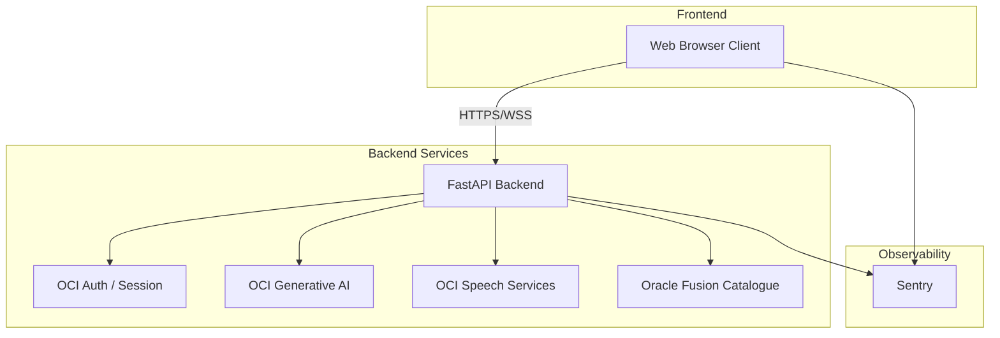

# Architecture Overview

## Component Diagram

## Directory Structure
- `/frontend`: Contains the Vite + React application. State management via React Context. Tests located in `/frontend/tests`.
- `/backend`: Contains the FastAPI application. Core domain logic in `/backend/services`. Tests located in `/backend/tests`.
- `/deploy`: Contains infrastructure-as-code (Ansible playbooks) and Docker Compose definitions for environment parity.
- `/.github`: Contains GitHub Actions workflows for CI/CD, dependency management (Dependabot), and repository templates.
