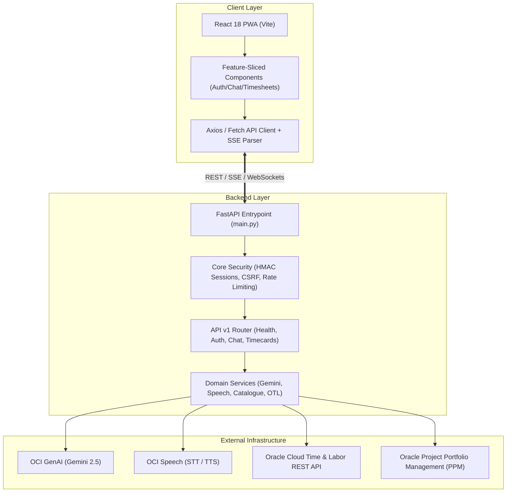

# 🏛️ Architecture & System Design Documentation

This document outlines the architectural patterns, security model, and component layout for the **OTL Voice-Enabled AI Timesheet Assistant**.

---

## 1. System Topology



---

## 2. Backend Design Patterns

### A. Separation of Concerns
1. **`backend/api/v1/` (Presentation & Routing Layer)**:
   - Contains route definitions with path validation, status codes, and dependency injection.
   - Handlers remain lightweight; business logic is delegated to the domain services.
2. **`backend/schemas/` (Data Transfer Object Layer)**:
   - Typed Pydantic models for incoming payloads and responses.
   - Prevents data leakage and ensures contract validity before reaching services.
3. **`backend/services/` (Domain & Infrastructure Layer)**:
   - Encapsulates external API integrations, caching mechanisms, and AI prompt pipelines.
4. **`backend/core/` (Cross-Cutting Concerns)**:
   - Security primitives, session management, CSRF validation, rate limiting, and connection pools.

### B. Security Architecture
- **Session Tokens**: Cryptographically signed HMAC-SHA256 tokens stored in `HttpOnly`, `SameSite=Lax` (or `Strict`) cookies.
- **CSRF Defense**: Double-submit cookie pattern with `X-CSRF-Token` header verification on all mutating HTTP verbs (`POST`, `PUT`, `DELETE`).
- **WebSocket Protection**: Origin header verification to prevent cross-site WebSocket hijacking, paired with IP-based connection limits.
- **Rate Limiting**: Sliding window rate limiter backed by in-memory stores or Redis.

---

## 3. Frontend Feature-Sliced Architecture

The frontend follows the **Feature-Sliced Design** pattern to enable multiple developers to work independently without file conflicts:

```
frontend/src/
├── api/             # HTTP client, error handlers, and type contracts
├── components/ui/   # Atomic, dumb UI elements (ToolChip, ThinkingState, icons)
├── features/        # Business domains
│   ├── auth/        # LoginView, credentials validation & tests
│   ├── chat/        # ChatView, Composer, MessageBubble & tests
│   └── timesheets/  # ReviewPanel, TimecardHistory, ProjectAssignments & tests
├── lib/             # Utility libraries (SSE, audio playback, speech recognition)
├── App.tsx          # Root session manager & router
└── main.tsx         # Bootstrap & service worker registration
```

---

## 4. Error Handling & Resilience

- **Structured API Errors**: All API exceptions return JSON with error codes, messages, and actionable details.
- **Graceful Speech Degradation**: If OCI Speech synthesis fails, the UI falls back gracefully to silent text responses.
- **Catalogue Caching**: The background worker assignment catalogue maintains a persistent SQLite cache to allow timesheet validation even during transient network disconnects.
