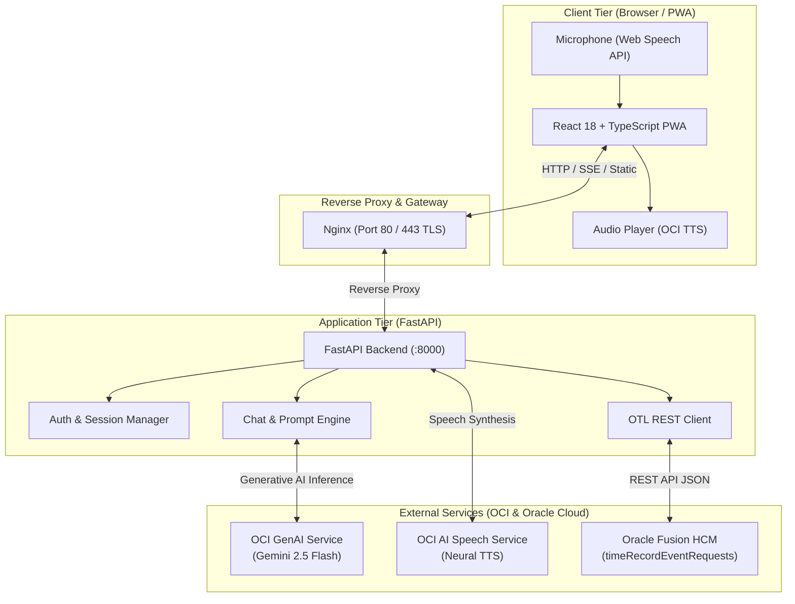

<div align="center">

# 🎙️ OTL Voice Timesheet Assistant

**An intelligent, voice-powered enterprise timesheet assistant for Oracle Time and Labor (OTL), powered by OCI GenAI (Gemini 2.5 Flash), OCI Speech Synthesis, and FastAPI.**

[](https://fastapi.tiangolo.com)
[](https://reactjs.org/)
[](https://www.typescriptlang.org/)
[](https://www.python.org/)
[-F80000.svg?logo=oracle&logoColor=white)](https://www.oracle.com/artificial-intelligence/generative-ai/generative-ai-service/)
[](https://www.docker.com/)
[](LICENSE)

[Features](#-key-features) • [Architecture](#-architecture) • [Quickstart](#-quickstart) • [Documentation](#-documentation-index) • [Configuration](#-configuration) • [Contributing](CONTRIBUTING.md)

</div>

---

## 📖 Overview

Logging timesheets in enterprise ERP systems like **Oracle Fusion Cloud HCM (Time and Labor / OTL)** can be tedious, multi-step, and error-prone. 

The **OTL Voice Timesheet Assistant** transforms this experience into a frictionless, natural conversation. Employees simply speak or type their daily accomplishments (e.g., *"I worked 5 hours on API integration for Project Alpha and 3 hours on client debugging"*). The assistant:

1. **Transcribes voice input in real-time** via the browser Web Speech API.
2. **Understands contextual project assignments** via **Google Gemini 2.5 Flash** hosted on **Oracle Cloud Infrastructure (OCI) Generative AI**.
3. **Validates work orders, projects, and task details** against local reference data with strict authorization checks.
4. **Submits structured timecards directly** to Oracle Fusion's REST API (`timeRecordEventRequests`).
5. **Responds with natural speech synthesis** powered by **OCI AI Speech Service (TTS)**.

---

## ✨ Key Features

- **🗣️ Natural Voice & Text Conversational Interface**: Speak or type naturally; the assistant extracts project numbers, hours, dates, and task descriptions automatically.
- **⚡ Real-Time Streaming SSE**: Streaming chat tokens delivered instantly to the UI via Server-Sent Events (SSE).
- **🔊 OCI Speech Synthesis (TTS)**: Clean, punctuation-stripped natural voice readout of assistant responses using OCI AI Speech.
- **🔒 Context-Aware Security & Assignment Guard**: Automatically injects signed-in employee identity and assigned work orders into the prompt context. Prevents unauthorized time logging against unassigned projects.
- **📱 Installable Progressive Web App (PWA)**: Built with React, TypeScript, and Vite with offline manifest, service worker, and mobile-responsive viewport.
- **📦 Single-Origin Production Container**: Multi-stage build packing the React PWA and FastAPI backend into a single container fronted by Nginx with TLS readiness.
- **📊 Excel Export & Audit Trail**: Comprehensive utilities for exporting timesheet records and employee assignments to spreadsheet formats.

---

## 🏛️ Architecture



---

## 🚀 Quickstart

### Option 1: One-Click Launch (Windows)

Double-click `start.bat` or run:

```bat
start.bat
```

This starts the Docker Compose stack in the background and opens `http://localhost` in your default browser.

---

### Option 2: Docker Compose

1. Clone repository and copy `.env.example`:
   ```bash
   git clone https://github.com/Shreyansh2203/OTL-Voice.git
   cd OTL-Voice
   cp .env.example .env
   ```
2. Configure your OCI and Oracle credentials in `.env`.
3. Launch with Docker Compose:
   ```bash
   cd deploy
   docker compose up --build
   ```
4. Access the web interface at `http://localhost`.

---

### Option 3: Local Development (Hot Reloading)

#### Prerequisites
- Python 3.12+ with [`uv`](https://docs.astral.sh/uv/)
- Node.js 20+ with `npm`

#### 1. Start the Backend
```bash
# From the project root
cp .env.example .env
uv sync
uv run uvicorn backend.main:app --host 0.0.0.0 --port 8000 --reload
```

#### 2. Start the Frontend
```bash
# In a new terminal
cd frontend
npm install
npm run dev
```

Visit `http://localhost:5173`. Vite automatically proxies `/api` requests to the FastAPI backend at port 8000.

---

## 📂 Project Structure

```text
timesheet-repo/
├── backend/
│   ├── core/
│   │   ├── auth.py              # Identity tracking & JWT-like session cookies
│   │   ├── config.py            # Environment variable validation
│   ├── models.py                # Core data models
│   ├── prompts/
│   │   └── prompt.txt           # Context-engineered system prompt for Gemini
│   ├── services/
│   │   ├── chat.py              # SSE chat stream generator & prompt builder
│   │   ├── oci_gemini.py        # OCI GenAI client (Gemini 2.5 Flash)
│   │   ├── oci_speech.py        # OCI Speech TTS client & markdown sanitizer
│   │   └── otl_client.py        # Oracle Fusion OTL REST client
│   └── main.py                  # FastAPI application & route definitions
├── frontend/
│   ├── src/
│   │   ├── api/client.ts        # Typed API & SSE streaming client
│   │   ├── components/          # ChatView, Composer, ReviewPanel, LoginView
│   │   ├── lib/                 # Audio player & SSE parser
│   │   ├── App.tsx              # Main application shell
│   │   └── index.css            # Custom responsive CSS design system
│   ├── package.json             # Frontend dependencies & scripts
│   └── vite.config.ts           # Vite + PWA configuration
├── deploy/
│   ├── docker-compose.yml       # Production container orchestration
│   └── nginx/otl.conf           # Nginx reverse proxy configuration
├── docs/                        # Deep-dive documentation
│   ├── ARCHITECTURE.md          # System architecture, prompt flow, and logic
│   ├── API.md                   # REST API documentation
│   ├── CONFIGURATION.md         # Environment variables and setups
│   └── DEPLOYMENT.md            # Docker, Nginx, and production hosting
├── .env.example                 # Sanitized environment template
├── Containerfile                # Multi-stage production container build
├── CONTRIBUTING.md              # Contributor onboarding & guidelines
├── LICENSE                      # MIT License
└── pyproject.toml               # Python project configuration (uv)
```

---

## 📚 Documentation Index

For detailed technical references, refer to the guides in the [`docs/`](docs/) directory:

| Guide | Description |
| :--- | :--- |
| **[Architecture Guide](docs/ARCHITECTURE.md)** | End-to-end data flows, voice pipeline, SSE protocol, and security model. |
| **[API Reference](docs/API.md)** | Endpoints, request schemas, and mock Oracle connection details. |
| **[Configuration Guide](docs/CONFIGURATION.md)** | Available environment variables and local vs production setups. |
| **[Deployment Guide](docs/DEPLOYMENT.md)** | Instructions for single-container deployments and reverse proxies. |

---

## ⚙️ Configuration

Key environment variables in `.env`:

| Variable | Description | Default |
| :--- | :--- | :--- |
| `OCI_COMPARTMENT_ID` | OCI Compartment OCID hosting GenAI & Speech | *Required* |
| `OCI_USER_OCID` | OCI User OCID for API signing | *Required* |
| `OCI_TENANCY_OCID` | OCI Tenancy OCID | *Required* |
| `OCI_FINGERPRINT` | Fingerprint of uploaded OCI public key | *Required* |
| `OCI_REGION` | OCI Region identifier | `us-ashburn-1` |
| `OCI_PRIVATE_KEY_PATH` | Path to private RSA PEM key | `./oci_api_key.pem` |
| `CHAT_MODEL_ID` | GenAI model OCID / ID | `google.gemini-2.5-flash` |
| `OTL_BASE_URL` | Oracle Fusion Timecard API endpoint | *Fusion SaaS URL* |
| `OTL_SERVICE_USERNAME` | Service account username for Fusion HCM | *Required* |
| `OTL_SERVICE_PASSWORD` | Service account password for Fusion HCM | *Required* |
| `STRICT_ASSIGNMENT` | Enforce employee project assignment checks | `true` |
| `DEFAULT_START_HOUR` | Default start hour for timecards when none is inferred | `9` |
| `DEFAULT_EXPENDITURE_TYPE` | Default expenditure type string for project-based entries | `Professional Services` |
| `SESSION_COOKIE_SECURE` | Set `Secure` flag on session cookie (set `true` with HTTPS) | `false` |

*(See [.env.example](.env.example) and [docs/CONFIGURATION.md](docs/CONFIGURATION.md) for full details).*

---

## 🛠️ Technology Stack

- **Frontend UI**: React 18, TypeScript, Tailwind CSS, Vite.
- **Backend API**: Python 3.12, FastAPI, Pydantic, Uvicorn.
- **AI Integration**: Google Gemini (`gemini-2.5-flash`), Oracle Cloud Infrastructure (OCI) SDK, OCI Generative AI Inference, OCI AI Speech Service.
- **DevOps**: Docker, Podman/Containerfile, Nginx, Docker Compose.

---

## 📄 License

This project is licensed under the MIT License - see the [LICENSE](LICENSE) file for details.
