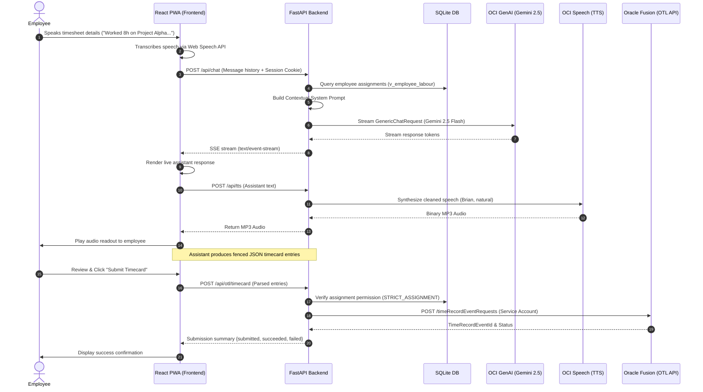
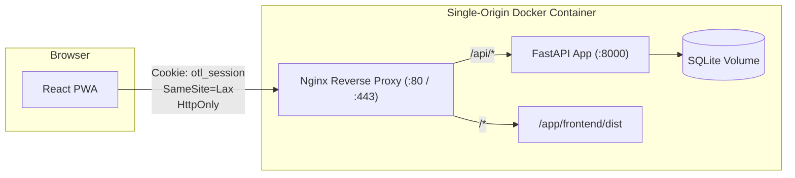

# System Architecture & Technical Design

This document details the architectural design, component interactions, and data flow pipelines of the **OTL Voice Timesheet Assistant**.

---

## 1. Architectural Overview

The application is structured into four primary layers:
1. **Client Layer (PWA)**: An installable Progressive Web App built with React and TypeScript, leveraging browser Web Speech API for real-time speech-to-text.
2. **Reverse Proxy Layer (Nginx)**: Edge proxy handling client routing, static asset caching, and SSL/TLS termination.
3. **Application Tier (FastAPI)**: Asynchronous Python backend executing business logic, session management, prompt construction, OCI service orchestration, and Oracle Fusion synchronization.
4. **External Services Tier**: Oracle Cloud Infrastructure (OCI GenAI & OCI Speech) and Oracle Fusion Cloud HCM (OTL REST API).

---

## 2. End-to-End Voice Timesheet Pipeline



---

## 3. Key Subsystems

### 3.1 Prompt Construction & Dynamic Context Injection

The assistant uses an expert system prompt template located at [`backend/prompts/prompt.txt`](../backend/prompts/prompt.txt). 

When a user initiates or continues a chat session (`POST /api/chat`):
1. The backend extracts the authenticated employee identity from the session cookie.
2. It queries [`repository.list_assignments(employee_id)`](../backend/db/repository.py) to fetch all work orders, projects, and active tasks the user is permitted to charge time to.
3. It dynamically renders the system prompt with:
   - `{{USERNAME}}`, `{{EMPLOYEE_NUMBER}}`, `{{EMPLOYEE_NAME}}`
   - `{{CURRENT_DATE}}`
   - `{{ASSIGNMENTS}}` (formatted list of authorized work orders, project IDs, names, and tasks)
4. Gemini 2.5 Flash is instructed to restrict time entries *strictly* to these assigned projects while remaining conversational and asking targeted follow-up questions for missing parameters (hours, date, task description).

---

### 3.2 Fenced JSON Generation & Validation

When all required parameters are collected, Gemini generates a structured JSON block inside markdown code fences:

```json
```json
{
  "entries": [
    {
      "projectNo": 1001,
      "projectName": "Project Alpha",
      "workOrder": "WO-101",
      "taskDetails": "API integration and performance tuning",
      "hours": 8,
      "date": "2026-08-14"
    }
  ]
}
```
```

The frontend [`ReviewPanel.tsx`](../frontend/src/components/ReviewPanel.tsx) regex-parses this fenced block in real time, rendering an interactive timecard review card with editable values before submission.

---

### 3.3 Strict Assignment Guard (`STRICT_ASSIGNMENT`)

Before sending requests to the upstream Oracle Fusion API:
- The backend executes `_resolve_entry()` in [`backend/main.py`](../backend/main.py).
- If `STRICT_ASSIGNMENT=true`, it checks whether the project exists and whether the employee is assigned to that project in SQLite.
- If an employee attempts to log hours against an unauthorized project, the API rejects the submission with a `400 Bad Request` and returns an informative list of their valid assigned projects.

---

### 3.4 Speech Synthesis & Audio Sanitization

Assistant messages contain Markdown formatting (bold text, asterisks, bullet points, JSON blocks). If passed directly to a Text-to-Speech (TTS) engine, the synthesizer reads literal punctuation aloud (e.g., *"asterisk asterisk Project Alpha asterisk asterisk"*).

The [`oci_speech.py`](../backend/services/oci_speech.py) service employs regex sanitization ([`clean_for_speech()`](../backend/services/oci_speech.py)) to:
- Strip fenced code blocks (` ```...``` `).
- Flatten markdown headings, bullets, blockquotes, and links.
- Preserve snake_case identifiers (e.g., `task_name`).
- Send only clean, conversational natural text to OCI Speech.

---

### 3.5 Session Security & Single-Origin Deployment



- **HttpOnly Cookies**: Session tokens (`otl_session`) are stored in cryptographically random in-memory session records with automatic expiration and pruning.
- **Single-Origin**: In production, the built frontend assets are served alongside the `/api` routes under a single origin, eliminating CORS complexity and cross-site cookie vulnerabilities.
