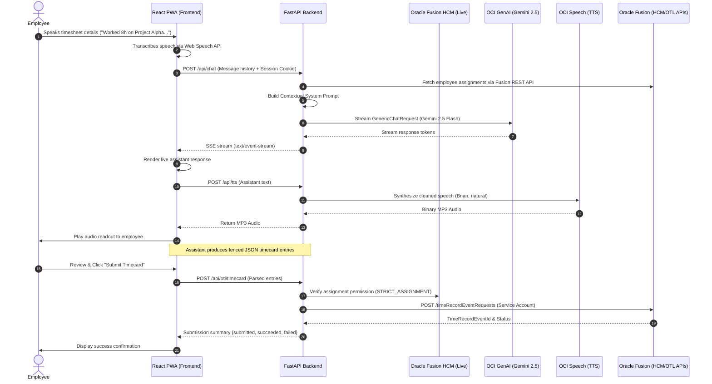
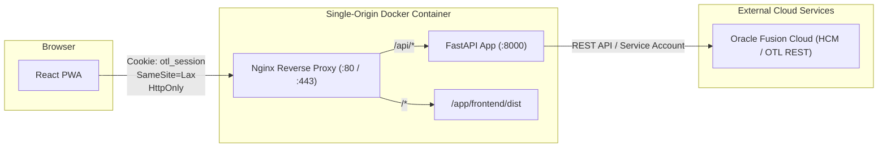

# System Architecture & Technical Design

This document details the architectural design, component interactions, and data flow pipelines of the **OTL Voice Timesheet Assistant**.

---

## 1. Architectural Overview

The application is structured into four primary layers:
1. **Client Layer (PWA)**: An installable Progressive Web App built with React and TypeScript, leveraging browser Web Speech API for real-time speech-to-text.
2. **Reverse Proxy Layer (Nginx)**: Edge proxy handling client routing, static asset caching, and SSL/TLS termination.
3. **Application Tier (FastAPI)**: Asynchronous Python backend executing business logic, session management, prompt construction, OCI service orchestration, and Oracle Fusion synchronization.
4. **External Services Tier**: Oracle Cloud Infrastructure (OCI GenAI & OCI Speech) and Oracle Fusion Cloud HCM (OTL REST API).

---

## 2. End-to-End Voice Timesheet Pipeline



---

## 3. Key Subsystems

### 3.1 Prompt Construction & Dynamic Context Injection

The assistant uses an expert system prompt template located at [`backend/prompts/prompt.txt`](../backend/prompts/prompt.txt). 

When a user initiates or continues a chat session (`POST /api/chat`):
1. The backend extracts the authenticated employee identity from the session cookie.
2. It calls Oracle Fusion APIs (`otl_client.list_worker_assignments()`) to fetch all work orders, projects, and active tasks the user is permitted to charge time to.
3. It calls `otl_client.list_timecard_entries()` (limit=1) to fetch the user's most recent timecard to populate **Smart Defaults**.
4. It dynamically renders the system prompt with:
   - `{{USERNAME}}`, `{{EMPLOYEE_NUMBER}}`, `{{EMPLOYEE_NAME}}`
   - `{{CURRENT_DATE}}`
   - `{{ASSIGNMENTS}}` (formatted list of authorized work orders, project IDs, names, and tasks)
   - `{{RECENT_HISTORY}}` (the employee's most recent timecard logging)
5. Gemini 2.5 Flash is instructed to adopt a friendly, voice-first tone, using implicit confirmations and flexible slot-filling to keep turns fast and natural. It proactively suggests the recent project based on `{{RECENT_HISTORY}}`. It injects native SSML `<break>` tags into its conversational flow for natural rhythm. It summarizes concisely using only natural language fields before finalizing.

---

### 3.2 Fenced JSON Generation & Validation

When all required parameters are collected, Gemini generates a structured JSON block inside markdown code fences:

```json
```json
{
  "entries": [
    {
      "projectNo": 1001,
      "projectName": "Project Alpha",
      "workOrder": "WO-101",
      "taskDetails": "API integration and performance tuning",
      "hours": 8,
      "date": "2026-08-14"
    }
  ]
}
```
```

The frontend [`ChatView.tsx`](../frontend/src/components/ChatView.tsx) regex-parses this fenced block in real time from the SSE stream, rendering an interactive timecard review card ([`ReviewPanel.tsx`](../frontend/src/components/ReviewPanel.tsx)) live.

---

### 3.3 Strict Assignment Guard (`STRICT_ASSIGNMENT`)

Before sending requests to the upstream Oracle Fusion API:
- The backend executes `_resolve_entry()` in [`backend/main.py`](../backend/main.py).
- If `STRICT_ASSIGNMENT=true`, it checks whether the project exists in the list returned by Fusion for that employee.
- If an employee attempts to log hours against an unauthorized project, the API rejects the submission with a `400 Bad Request` and returns an informative list of their valid assigned projects.

---

### 3.4 Speech Synthesis & SSML Handling

Assistant messages contain Markdown formatting (bold text, asterisks, bullet points, JSON blocks) and SSML tags (`<break time="300ms"/>`). 

The [`oci_speech.py`](../backend/services/oci_speech.py) service employs regex sanitization ([`clean_for_speech()`](../backend/services/oci_speech.py)) to:
- Strip fenced code blocks (` ```...``` `).
- Flatten markdown headings, bullets, blockquotes, and links.
- Preserve explicit SSML tags generated by the prompt. If `<break`, `<emphasis`, or `<prosody` are detected in the clean text, the service dynamically switches the request `Content-Type` from `TEXT` to `SSML` and wraps the payload in a `<speak>` root node before sending it to OCI TTS.
- The frontend [`MessageBubble.tsx`](../frontend/src/components/MessageBubble.tsx) visually strips these SSML XML tags so the user only sees conversational text.

---

### 3.6 Continuous Voice Loop & Auto-Submission

To provide a fully hands-free experience:
1. **Barge-in**: The Web Speech API `onspeechstart` event fires immediately when the user speaks, dispatching an `otl:barge-in` window event that halts TTS audio playback mid-sentence.
2. **Auto-Submit & Undo**: Once the final JSON block is streamed, the frontend initiates a 4-second countdown. If not canceled, it automatically submits the entries via `/api/otl/timecard`.
3. **Continuous Logging**: The `ChatView` delays briefly (echo cancellation) and then immediately turns the microphone back on. The assistant asks, "Submitted! Do you need to log anything else?", creating an infinite loop that naturally terminates only when the user says "No" and the assistant replies with "Goodbye".

---

### 3.5 Session Security & Single-Origin Deployment



- **Authentication & Worker Lookup Flow**:
  1. The login endpoint (`POST /api/auth/login`) accepts an employee's Person Number as the `username` (password validation is currently bypassed for testing; worker lookup uses the backend service account).
  2. The backend looks up the worker in Oracle Fusion HCM via `otl_client.get_worker(service_credential, person_number)`.
  3. The `SameSite` cookie attribute (`SESSION_COOKIE_SAMESITE`, defaulting to `lax`) is validated safely and cast to a `Literal["lax", "strict", "none"]` type before setting the cookie.
- **HttpOnly Cookies**: Session tokens (`otl_session`) are stored in cryptographically random in-memory session records with automatic expiration and pruning.
- **Single-Origin**: In production, the built frontend assets are served alongside the `/api` routes under a single origin, eliminating CORS complexity and cross-site cookie vulnerabilities.
