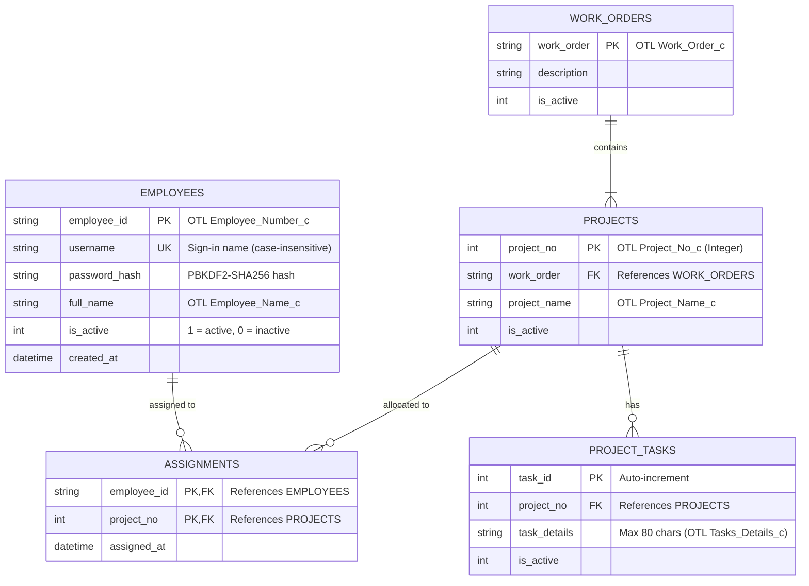

# Database Design & Reference Model

This document describes the SQLite reference database schema, entity relationships, seeding lifecycle, and reporting utilities.

---

## 1. Role in the System

While primary timecard entries are submitted directly to **Oracle Fusion Cloud HCM**, the local SQLite database (`otl_dummy.db`) acts as the authoritative reference catalogue for:
- **Employee Sign-in & Authentication**: Local usernames, full names, employee numbers, and salted password hashes.
- **Labour Catalogue**: Work orders, assigned project numbers, project names, and common task details.
- **Assignment Authorization**: Explicit mapping of which employees are permitted to charge hours to specific projects.

---

## 2. Entity-Relationship (ER) Diagram



---

## 3. Tables & Schema Specification

### 3.1 `employees`
Stores employee profile details and authentication credentials.

| Column | Type | Constraints | Description |
| :--- | :--- | :--- | :--- |
| `employee_id` | `TEXT` | `PRIMARY KEY` | OTL Employee Number (e.g. `"90407"`). |
| `username` | `TEXT` | `NOT NULL UNIQUE COLLATE NOCASE` | Sign-in username. |
| `password_hash` | `TEXT` | `NOT NULL` | Formatted `pbkdf2_sha256$iters$salt$hash`. |
| `full_name` | `TEXT` | `NOT NULL` | Employee full name written to OTL. |
| `is_active` | `INTEGER`| `NOT NULL DEFAULT 1` | Status flag. |
| `created_at` | `TEXT` | `DEFAULT (datetime('now'))` | Timestamp. |

---

### 3.2 `work_orders` & `projects`
Enforces a strict hierarchy:
- **One Work Order** contains **many Projects**.
- **Each Project** belongs to **exactly one Work Order**.

---

### 3.3 `project_tasks`
Suggested task descriptions under each project. Oracle Time and Labor enforces an **80-character maximum** on the `Tasks_Details_c` column:

```sql
CHECK (length(task_details) <= 80)
```

---

### 3.4 Flat Read View: `v_employee_labour`

A pre-joined view used by the backend to fetch an employee's authorized catalogue in a single query:

```sql
CREATE VIEW IF NOT EXISTS v_employee_labour AS
SELECT e.employee_id,
       e.username,
       e.full_name,
       p.work_order,
       p.project_no,
       p.project_name,
       t.task_id,
       t.task_details
FROM assignments a
JOIN employees e USING (employee_id)
JOIN projects  p USING (project_no)
LEFT JOIN project_tasks t
       ON t.project_no = p.project_no AND t.is_active = 1
WHERE e.is_active = 1 AND p.is_active = 1;
```

---

## 4. Seeding & Initialization

On application startup, [`backend/db/seed.py`](../backend/db/seed.py) executes [`ensure_seeded()`](../backend/db/seed.py):
1. Creates the database schema at `OTL_DB_PATH` if missing.
2. If `employees` table is empty, parses [`backend/db/seed.json`](../backend/db/seed.json) and populates default employees, work orders, projects, and task assignments.
3. Automatically computes secure PBKDF2 password hashes for seed users.

---

## 5. Excel Export Utility

The module [`backend/db/export_excel.py`](../backend/db/export_excel.py) provides formatted Excel workbook generation (`.xlsx`) using `openpyxl`. It produces sheets with styling, headers, and assignment matrices suitable for management review and audit reconciliation.
