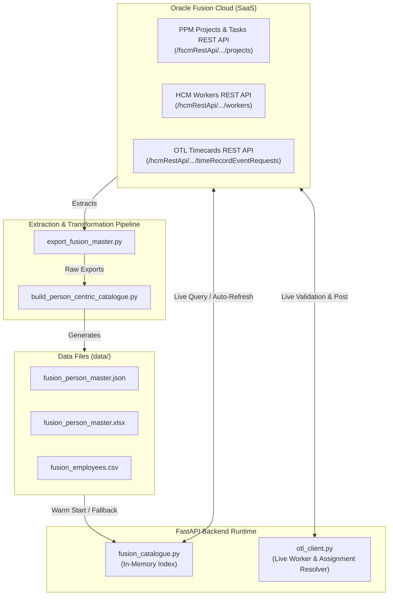

# Data Architecture & Fusion Master Catalogue

This document describes the data architecture of the **OTL Voice Timesheet Assistant**, including the live in-memory Oracle Fusion catalogue, offline fallback datasets, data extraction pipelines, and reporting formats.

---

## 1. Data Architecture Overview



---

## 2. In-Memory Live Catalogue (`fusion_catalogue.py`)

To ensure sub-second response times for the conversational AI agent while maintaining synchronization with Oracle Fusion:
1. **Startup Warmup**: On application startup (`lifespan`), the backend initializes the live catalogue by fetching all active projects, tasks, and team member assignments directly from the Oracle Fusion PPM REST API.
2. **In-Memory Index**: Projects and tasks are indexed in memory by person name and person number, enabling instant lookups when constructing prompt context for Gemini.
3. **Scheduled Auto-Refresh**: A background task periodically re-queries Oracle Fusion on a configurable interval (controlled by `CATALOGUE_REFRESH_SECONDS`, default: `21600` / 6 hours).
4. **On-Demand Admin Refresh**: Administrators can trigger an instant background refresh via `POST /api/admin/refresh-catalogue`.

---

## 3. Data Files in `data/`

| File | Format | Description |
| :--- | :---: | :--- |
| `data/fusion_person_master.json` | JSON | Person-centric master index mapping each employee to their authorized projects, work orders, and tasks. |
| `data/fusion_person_master.xlsx` | Excel | Formatted multi-tab spreadsheet with summary matrices, worker sheets, and project allocations. |
| `data/fusion_employees.csv` | CSV | Flattened list of all active employees (person numbers, names, emails, department, job title). |
| `data/fusion_employees.json` | JSON | Structured employee profiles exported directly from Fusion HCM. |
| `data/fusion_master_catalogue.json` | JSON | Consolidated raw project, task, and team member catalogue. |
| `data/fusion_master_catalogue.xlsx` | Excel | Excel workbook of all raw projects, tasks, and assigned personnel. |

---

## 4. Extraction & Pipeline Tools

The repository includes dedicated CLI utilities for synchronizing and inspecting Oracle Fusion data:

### 4.1 Master Exporter (`export_fusion_master.py`)
Connects to Oracle Fusion Cloud via REST / BIP and extracts all workers, projects, project tasks, and team member allocations:
```bash
python export_fusion_master.py
```
Outputs raw JSON and `.xlsx` files into the `data/` directory.

### 4.2 Person-Centric Transformer (`build_person_centric_catalogue.py`)
Processes raw project exports and joins them with team member rosters to build clean, person-indexed catalogues:
```bash
python build_person_centric_catalogue.py
```

### 4.3 Fusion CLI Explorer (`explore_fusion.py`)
Interactive CLI diagnostic utility to inspect Fusion endpoints, test query filters, and review payload structures:
```bash
python explore_fusion.py
```

---

## 5. Automated Test & Verification Suite

The repository includes diagnostic scripts to validate all integration points:

| Script | Purpose | Execution Command |
| :--- | :--- | :--- |
| `test_fusion_rest.py` | Tests REST authentication, worker search, and project pagination. | `python test_fusion_rest.py` |
| `test_fusion_bip.py` | Validates BI Publisher SOAP / SQL reporting capabilities. | `python test_fusion_bip.py` |
| `test_catalogue_lookup.py` | Tests in-memory person index resolution and lookup speed. | `python test_catalogue_lookup.py` |
| `test_api_projects.py` | Validates live project retrieval and JSON mapping. | `python test_api_projects.py` |
| `test_e2e_validation.py` | End-to-end simulation of worker login, assignment query, prompt generation, and OTL submission. | `python test_e2e_validation.py` |
